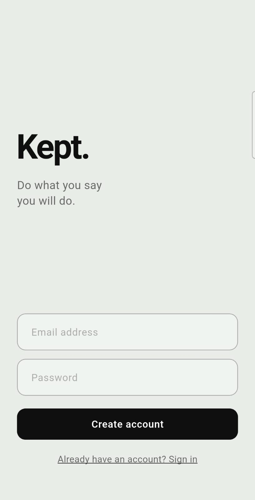
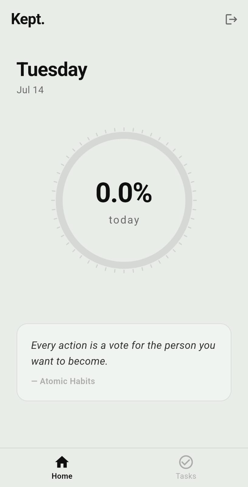
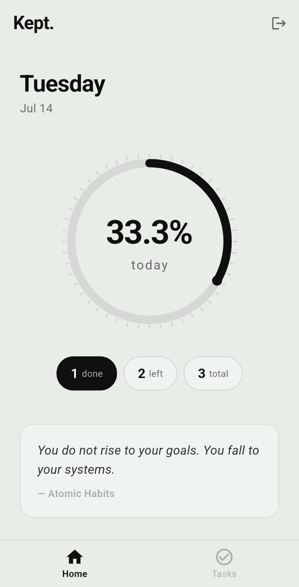
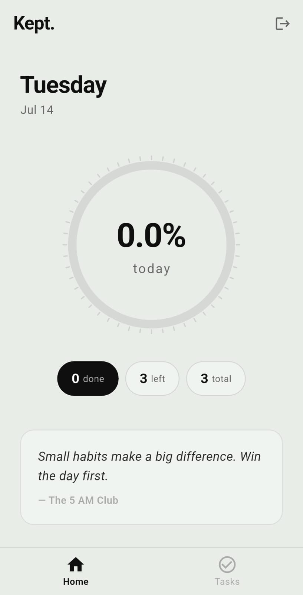
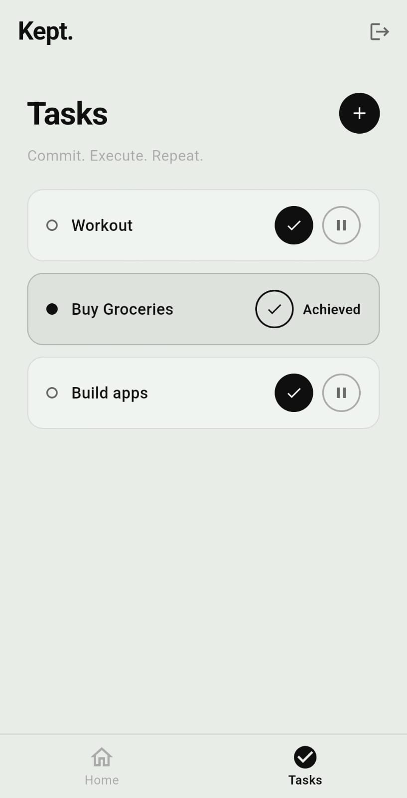
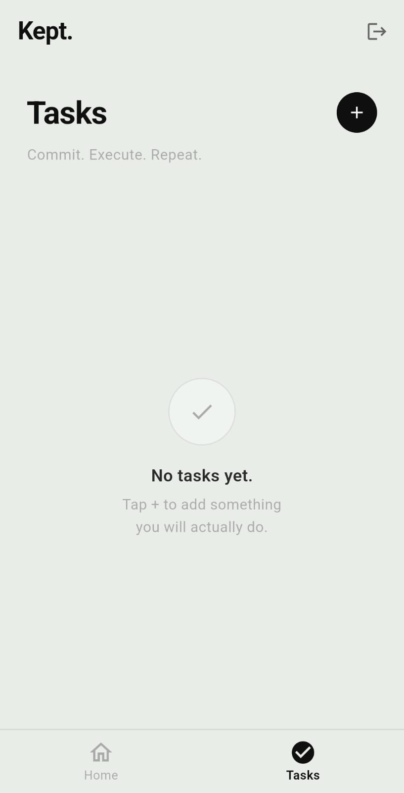

# Kept.

A daily task accountability app built with Flutter.

The idea is simple — whatever you plan to do today, you either did it or you didn't. No deleting tasks, no carrying them over. Every task ends as **Achieved** or **Postponed**. The progress ring shows your honest follow-through rate for the day.

---

## Screenshots

| Sign Up | Home | Home with Progress |
|---|---|---|
|  |  |  |

| Home with Tasks | Tasks | Tasks Empty |
|---|---|---|
|  |  |  |

---

## Built With

- Flutter & Dart
- Firebase Auth — email and password login
- Cloud Firestore — real-time task storage
- Riverpod — state management
- Gemini AI — motivational quotes via REST API
- Dio — HTTP client
- MVVM Architecture

---

## Features

- Daily progress ring showing percentage of tasks completed
- Tasks marked as Achieved or Postponed — no deleting
- Confirmation dialog before marking a task complete
- Automatic day reset when app opens on a new day
- Rotating motivational quotes from books like Atomic Habits and Deep Work
- Real-time updates across screens using Firestore streams

---

## How To Run

1. Clone the repo
```bash
git clone https://github.com/priyath11/kept.git
cd kept
```

2. Install packages
```bash
flutter pub get
```

3. Connect your Firebase project
```bash
flutterfire configure
```

4. Add your Gemini API key in `lib/services/quote_service.dart`

5. Run
```bash
flutter run
```

---

## Project Structure